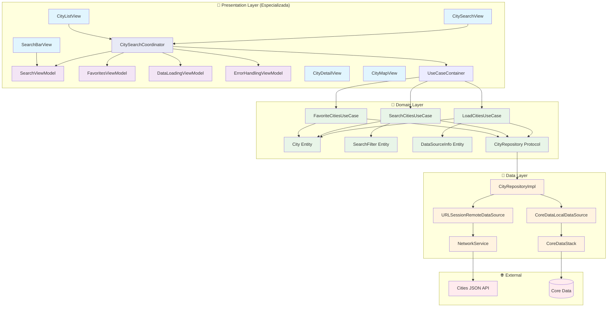
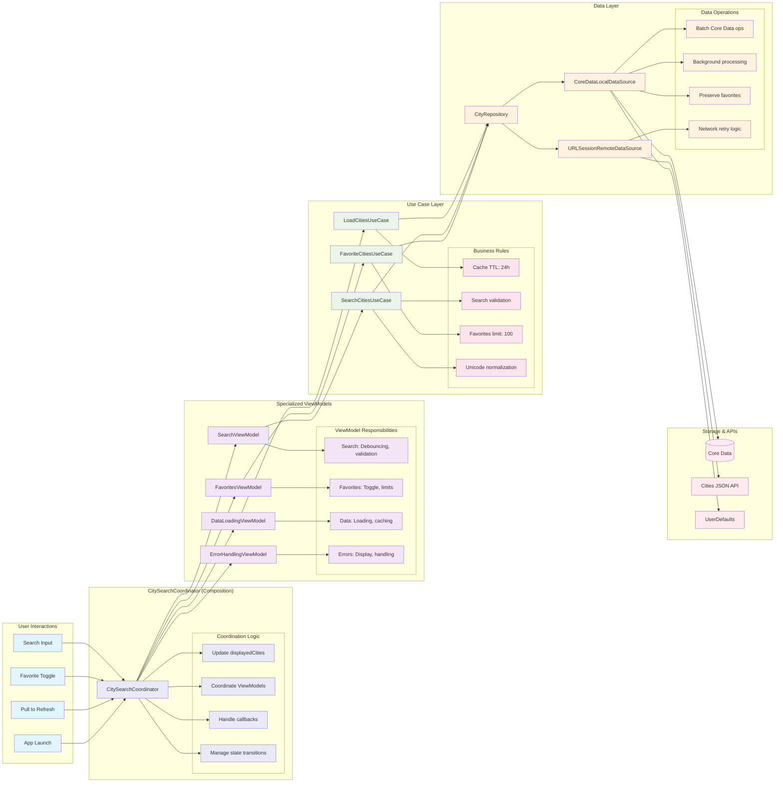

# ualaCities - Architecture Diagrams

Este documento contiene los diagramas de arquitectura del proyecto SmartCityExploration, implementando Clean Architecture con MVVM y Composition Pattern.

## 🏗️ Clean Architecture Overview



## 📱 Presentation Layer Architecture 

```mermaid
graph TB
    subgraph "Views (SwiftUI)"
        CSV[CitySearchView]
        CDV[CityDetailView]
        CMV[CityMapView]
        SBV[SearchBarView Component]
        CLV[CityListView Component]
    end
    
    subgraph "CitySearchCoordinator (Composition Pattern)"
        COORD[CitySearchCoordinator]
        
        subgraph "Coordinator State"
            CS1[displayedCities: [City]]
            CS2[isSearching: Bool]
        end
        
        subgraph "Coordinator Methods"
            CM1[loadInitialData()]
            CM2[refreshData()]
            CM3[toggleFavorite()]
            CM4[toggleFavoritesFilter()]
            CM5[clearSearch()]
        end
    end
    
    subgraph "Specialized ViewModels (@MainActor)"
        SVM[SearchViewModel]
        FVM[FavoritesViewModel]
        DVM[DataLoadingViewModel]
        EVM[ErrorHandlingViewModel]
        
        subgraph "SearchViewModel State"
            SS1[searchText: String]
            SS2[searchResults: [City]]
            SS3[isSearching: Bool]
            SS4[isSearchLoading: Bool]
        end
        
        subgraph "FavoritesViewModel State"
            FS1[favorites: [City]]
            FS2[showOnlyFavorites: Bool]
        end
        
        subgraph "DataLoadingViewModel State"
            DS1[cities: [City]]
            DS2[isLoading: Bool]
            DS3[isInitialLoading: Bool]
            DS4[isRefreshing: Bool]
            DS5[dataSourceInfo: DataSourceInfo?]
        end
        
        subgraph "ErrorHandlingViewModel State"
            ES1[errorMessage: String?]
            ES2[showError: Bool]
            ES3[lastError: Error?]
        end
    end
    
    subgraph "UseCaseContainer (Dependency Injection)"
        UC[UseCaseContainer]
        
        subgraph "Use Cases"
            UC1[SearchCitiesUseCase]
            UC2[FavoriteCitiesUseCase]
            UC3[LoadCitiesUseCase]
        end
    end
    
    %% View Dependencies
    CSV --> COORD
    CDV --> COORD
    CMV --> COORD
    SBV --> SVM
    CLV --> COORD
    
    %% Coordinator Dependencies
    COORD --> SVM
    COORD --> FVM
    COORD --> DVM
    COORD --> EVM
    COORD --> UC
    
    %% UseCaseContainer Dependencies
    UC --> UC1
    UC --> UC2
    UC --> UC3
    
    %% State Management
    COORD --> CS1
    COORD --> CS2
    COORD --> CM1
    COORD --> CM2
    COORD --> CM3
    COORD --> CM4
    COORD --> CM5
    
    SVM --> SS1
    SVM --> SS2
    SVM --> SS3
    SVM --> SS4
    
    FVM --> FS1
    FVM --> FS2
    
    DVM --> DS1
    DVM --> DS2
    DVM --> DS3
    DVM --> DS4
    DVM --> DS5
    
    EVM --> ES1
    EVM --> ES2
    EVM --> ES3
    
    classDef view fill:#e1f5fe
    classDef coordinator fill:#e8eaf6
    classDef viewmodel fill:#f3e5f5
    classDef container fill:#e8f5e8
    classDef state fill:#fce4ec
    
    class CSV,CDV,CMV,SBV,CLV view
    class COORD coordinator
    class SVM,FVM,DVM,EVM viewmodel
    class UC,UC1,UC2,UC3 container
    class CS1,CS2,CM1,CM2,CM3,CM4,CM5,SS1,SS2,SS3,SS4,FS1,FS2,DS1,DS2,DS3,DS4,DS5,ES1,ES2,ES3 state
```

## 🔧 Domain Layer Architecture

```mermaid
graph TB
    subgraph "Use Cases (Business Logic)"
        LUC[LoadCitiesUseCase]
        SUC[SearchCitiesUseCase]
        FUC[FavoriteCitiesUseCase]
        
        subgraph "LoadCitiesUseCase Logic"
            L1[execute: Check cache TTL]
            L2[forceRefresh: Download new data]
            L3[getDataInfo: Diagnostics]
            L4[Cache expires after 24h]
        end
        
        subgraph "SearchCitiesUseCase Logic"
            S1[execute: City → Country priority]
            S2[validateFilter: Min length, limits]
            S3[applyFilters: Favorites, query]
            S4[Unicode normalization]
        end
        
        subgraph "FavoriteCitiesUseCase Logic"
            F1[toggleFavorite: Max 100 limit]
            F2[getFavorites: All favorites]
            F3[addToFavorites: Validation]
            F4[removeFromFavorites: Safe removal]
        end
    end
    
    subgraph "Domain Entities"
        CE[City Entity]
        SF[SearchFilter Entity]
        DSI[DataSourceInfo Entity]
        CO[Coordinate Entity]
        
        subgraph "City Properties"
            CP1[id: Int]
            CP2[name: String]
            CP3[country: String]
            CP4[coord: Coordinate]
            CP5[isFavorite: Bool]
            CP6[displayName: computed]
            CP7[searchableText: computed]
        end
        
        subgraph "SearchFilter Properties"
            SP1[query: String]
            SP2[showOnlyFavorites: Bool]
            SP3[limit: Int?]
            SP4[searchInCountry: Bool]
        end
    end
    
    subgraph "Repository Protocol"
        RP[CityRepository Protocol]
        
        subgraph "Repository Methods"
            RM1[downloadAndSaveCities()]
            RM2[searchCities(filter)]
            RM3[toggleFavorite(city)]
            RM4[getAllCities()]
            RM5[getDataSourceInfo()]
        end
    end
    
    subgraph "UseCaseContainer (Dependency Injection)"
        UC[UseCaseContainer]
        
        subgraph "Container Features"
            C1[Centralized dependency creation]
            C2[Mock support for testing]
            C3[Factory pattern implementation]
        end
    end
    
    LUC --> L1
    LUC --> L2
    LUC --> L3
    LUC --> L4
    
    SUC --> S1
    SUC --> S2
    SUC --> S3
    SUC --> S4
    
    FUC --> F1
    FUC --> F2
    FUC --> F3
    FUC --> F4
    
    LUC --> RP
    SUC --> RP
    FUC --> RP
    
    LUC --> CE
    LUC --> DSI
    SUC --> CE
    SUC --> SF
    FUC --> CE
    
    CE --> CP1
    CE --> CP2
    CE --> CP3
    CE --> CP4
    CE --> CP5
    CE --> CP6
    CE --> CP7
    
    SF --> SP1
    SF --> SP2
    SF --> SP3
    SF --> SP4
    
    RP --> RM1
    RP --> RM2
    RP --> RM3
    RP --> RM4
    RP --> RM5
    
    UC --> LUC
    UC --> SUC
    UC --> FUC
    UC --> C1
    UC --> C2
    UC --> C3
    
    classDef usecase fill:#f3e5f5
    classDef entity fill:#e8f5e8
    classDef protocol fill:#fff3e0
    classDef container fill:#e1f5fe
    classDef logic fill:#fce4ec
    
    class LUC,SUC,FUC usecase
    class CE,SF,DSI,CO entity
    class RP protocol
    class UC container
    class L1,L2,L3,L4,S1,S2,S3,S4,F1,F2,F3,F4,CP1,CP2,CP3,CP4,CP5,CP6,CP7,SP1,SP2,SP3,SP4,RM1,RM2,RM3,RM4,RM5,C1,C2,C3 logic
```

## 💾 Data Layer Architecture

```mermaid
graph TB
    subgraph "Repository Implementation"
        CRI[CityRepositoryImpl]
        
        subgraph "Repository Methods"
            R1[downloadAndSaveCities: Orchestrates data flow]
            R2[searchCities: Delegates to local data source]
            R3[toggleFavorite: Updates persistence]
            R4[getDataSourceInfo: Aggregates metrics]
        end
    end
    
    subgraph "Data Sources"
        LDS[CoreDataLocalDataSource]
        RDS[URLSessionRemoteDataSource]
        
        subgraph "Local Data Source"
            L1[saveCities: Batch operations]
            L2[searchCities: Optimized queries]
            L3[getFavoriteCities: Filtered fetch]
            L4[toggleFavorite: Thread-safe updates]
            L5[Preserve favorites during refresh]
        end
        
        subgraph "Remote Data Source"
            R1[downloadCities: HTTP client]
            R2[Retry mechanism: 3 attempts]
            R3[Network error mapping]
            R4[JSON decoding with validation]
        end
    end
    
    subgraph "Core Data Stack"
        CDS[CoreDataStack]
        CE[CityEntity + Extensions]
        
        subgraph "Core Data Features"
            C1[Thread-safe operations]
            C2[Background context for data ops]
            C3[Main context for UI]
            C4[Batch insert/update/delete]
            C5[Optimized fetch requests]
        end
        
        subgraph "CityEntity Extensions"
            E1[fetchRequestById]
            E2[fetchRequestForFavorites]
            E3[fetchRequestForCityNamePrefix]
            E4[fetchRequestForCountryPrefix]
            E5[normalizeQuery helper]
        end
    end
    
    subgraph "Network Layer"
        NS[URLSessionNetworkService]
        NC[NetworkConfiguration]
        
        subgraph "Network Features"
            N1[URLSession with timeout]
            N2[Automatic retry logic]
            N3[Error mapping and handling]
            N4[Request/Response logging]
        end
    end
    
    subgraph "External Dependencies"
        API[Cities JSON API]
        CD[(Core Data SQLite)]
        UD[UserDefaults: Last update]
    end
    
    CRI --> R1
    CRI --> R2
    CRI --> R3
    CRI --> R4
    
    CRI --> LDS
    CRI --> RDS
    
    LDS --> L1
    LDS --> L2
    LDS --> L3
    LDS --> L4
    LDS --> L5
    
    RDS --> R1
    RDS --> R2
    RDS --> R3
    RDS --> R4
    
    LDS --> CDS
    RDS --> NS
    
    CDS --> C1
    CDS --> C2
    CDS --> C3
    CDS --> C4
    CDS --> C5
    
    CDS --> CE
    CE --> E1
    CE --> E2
    CE --> E3
    CE --> E4
    CE --> E5
    
    NS --> NC
    NS --> N1
    NS --> N2
    NS --> N3
    NS --> N4
    
    CDS --> CD
    NS --> API
    LDS --> UD
    
    classDef repository fill:#e8f5e8
    classDef datasource fill:#e1f5fe
    classDef coredata fill:#f3e5f5
    classDef network fill:#fff3e0
    classDef external fill:#ffebee
    classDef method fill:#fce4ec
    
    class CRI repository
    class LDS,RDS datasource
    class CDS,CE coredata
    class NS,NC network
    class API,CD,UD external
    class R1,R2,R3,R4,L1,L2,L3,L4,L5,R1,R2,R3,R4,C1,C2,C3,C4,C5,E1,E2,E3,E4,E5,N1,N2,N3,N4 method
```



## 🔄 Data Flow Architecture



## 🎯 Dependency Injection Architecture 

```mermaid
graph TB
    subgraph "UseCaseContainer (Centralized DI)"
        UC[UseCaseContainer]
        
        subgraph "Container Methods"
            CM1[create(): Production]
            CM2[createMock(): Testing]
        end
    end
    
    subgraph "CitySearchCoordinator Factory"
        CF[CitySearchCoordinatorFactory]
        
        subgraph "Factory Methods"
            FM1[create(): Production]
            FM2[createMock(): Testing]
        end
    end
    
    subgraph "Dependency Graph (Refactorizada)"
        COORD[CitySearchCoordinator]
        
        subgraph "Specialized ViewModels"
            SVM[SearchViewModel]
            FVM[FavoritesViewModel]
            DVM[DataLoadingViewModel]
            EVM[ErrorHandlingViewModel]
        end
        
        subgraph "Use Cases"
            UC1[LoadCitiesUseCase]
            UC2[SearchCitiesUseCase]
            UC3[FavoriteCitiesUseCase]
        end
        
        subgraph "Repository"
            REPO[CityRepository]
        end
        
        subgraph "Data Sources"
            LOCAL[CoreDataLocalDataSource]
            REMOTE[URLSessionRemoteDataSource]
        end
        
        subgraph "Infrastructure"
            CDS[CoreDataStack]
            NS[NetworkService]
        end
    end
    
    subgraph "Testing Layer"
        TMF[TestMockFactory]
        
        subgraph "Mock Objects"
            MUC1[MockLoadCitiesUseCase]
            MUC2[MockSearchCitiesUseCase]
            MUC3[MockFavoriteCitiesUseCase]
            MREPO[MockCityRepository]
        end
    end
    
    %% Production Dependencies
    CF --> FM1
    CF --> FM2
    CF --> UC
    
    UC --> CM1
    UC --> CM2
    
    FM1 --> COORD
    COORD --> SVM
    COORD --> FVM
    COORD --> DVM
    COORD --> EVM
    
    SVM --> UC2
    FVM --> UC3
    DVM --> UC1
    EVM --> UC1
    
    UC1 --> REPO
    UC2 --> REPO
    UC3 --> REPO
    
    REPO --> LOCAL
    REPO --> REMOTE
    
    LOCAL --> CDS
    REMOTE --> NS
    
    %% Test Dependencies
    FM2 --> TMF
    TMF --> MUC1
    TMF --> MUC2
    TMF --> MUC3
    TMF --> MREPO
    
    %% Alternative test injection
    COORD -.-> MUC1
    COORD -.-> MUC2
    COORD -.-> MUC3
    
    classDef container fill:#e1f5fe
    classDef factory fill:#e8f5e8
    classDef production fill:#f3e5f5
    classDef testing fill:#fff3e0
    classDef mock fill:#ffebee
    
    class UC,CF,CM1,CM2,FM1,FM2 container
    class COORD,SVM,FVM,DVM,EVM,UC1,UC2,UC3,REPO,LOCAL,REMOTE,CDS,NS production
    class TMF testing
    class MUC1,MUC2,MUC3,MREPO mock
```

## 📱 SwiftUI + MVVM Integration

```mermaid
graph TB
    subgraph "SwiftUI Views"
        CSV[CitySearchView]
        
        subgraph "View Hierarchy"
            VH1[NavigationStack]
            VH2[SearchBarView Component]
            VH3[CityListView Component]
            VH4[Loading/Error States]
        end
        
        subgraph "View Modifiers"
            MOD1[.searchable]
            MOD2[.refreshable]
            MOD3[.alert]
            MOD4[.navigationTitle]
        end
    end
    
    subgraph "CitySearchCoordinator (@MainActor)"
        COORD[CitySearchCoordinator]
        
        subgraph "@Published Properties"
            P1[displayedCities: [City]]
            P2[isSearching: Bool]
        end
        
        subgraph "Coordination Methods"
            CM1[loadInitialData()]
            CM2[refreshData()]
            CM3[toggleFavorite()]
            CM4[toggleFavoritesFilter()]
            CM5[clearSearch()]
        end
    end
    
    subgraph "Specialized ViewModels"
        SVM[SearchViewModel]
        FVM[FavoritesViewModel]
        DVM[DataLoadingViewModel]
        EVM[ErrorHandlingViewModel]
        
        subgraph "ViewModel States"
            VS1[searchText, searchResults]
            VS2[favorites, showOnlyFavorites]
            VS3[cities, isLoading, dataSourceInfo]
            VS4[errorMessage, showError]
        end
    end
    
    subgraph "Reactive Bindings"
        BIND1[$searchText binding]
        BIND2[State observations]
        BIND3[Combine publishers]
        BIND4[Debouncing logic]
    end
    
    subgraph "SwiftUI Lifecycle"
        LIFE1[.onAppear]
        LIFE2[.task]
        LIFE3[.onChange]
        LIFE4[.refreshable]
    end
    
    CSV --> VH1
    CSV --> VH2
    CSV --> VH3
    CSV --> VH4
    
    CSV --> MOD1
    CSV --> MOD2
    CSV --> MOD3
    CSV --> MOD4
    
    CSV --> COORD
    
    COORD --> P1
    COORD --> P2
    COORD --> CM1
    COORD --> CM2
    COORD --> CM3
    COORD --> CM4
    COORD --> CM5
    
    COORD --> SVM
    COORD --> FVM
    COORD --> DVM
    COORD --> EVM
    
    SVM --> VS1
    FVM --> VS2
    DVM --> VS3
    EVM --> VS4
    
    VH2 --> BIND1
    CSV --> BIND2
    COORD --> BIND3
    BIND3 --> BIND4
    
    CSV --> LIFE1
    CSV --> LIFE2
    CSV --> LIFE3
    CSV --> LIFE4
    
    LIFE1 --> CM1
    LIFE2 --> CM1
    LIFE3 --> CM4
    LIFE4 --> CM2
    
    classDef view fill:#e1f5fe
    classDef coordinator fill:#e8eaf6
    classDef viewmodel fill:#f3e5f5
    classDef binding fill:#e8f5e8
    classDef lifecycle fill:#fff3e0
    classDef property fill:#fce4ec
    
    class CSV,VH1,VH2,VH3,VH4,MOD1,MOD2,MOD3,MOD4 view
    class COORD coordinator
    class SVM,FVM,DVM,EVM viewmodel
    class BIND1,BIND2,BIND3,BIND4 binding
    class LIFE1,LIFE2,LIFE3,LIFE4 lifecycle
    class P1,P2,CM1,CM2,CM3,CM4,CM5,VS1,VS2,VS3,VS4 property
```

---

## 📋 Architecture Summary 

### Key Architectural Decisions

1. **Clean Architecture**: Clear separation between Presentation, Domain, and Data layers
2. **MVVM Especializado**: ViewModels with single responsibility principle
3. **Composition Pattern**: CitySearchCoordinator composes specialized ViewModels
4. **Dependency Injection**: UseCaseContainer for centralized dependency management
5. **Swift 6 Concurrency**: @MainActor for UI, background tasks for data operations
6. **Repository Pattern**: Abstract data access with multiple data sources
7. **Use Case Pattern**: Encapsulate business rules and validation logic

### Performance Optimizations

1. **Batch Core Data Operations**: Efficient large dataset handling
2. **Debouncing**: Prevent excessive search operations
3. **Background Processing**: Keep UI responsive during data operations
4. **Smart Caching**: 24-hour TTL with fallback to local data
5. **Optimized Queries**: Prioritized search (city → country)
6. **ViewModels Especializados**: Better memory management and performance

### Testing Strategy

1. **Unit Tests**: Isolated testing with mock dependencies
2. **Use Case Tests**: Business logic validation
3. **ViewModel Tests**: Specialized ViewModels testing
4. **Coordinator Tests**: Integration between ViewModels
5. **Integration Tests**: End-to-end data flow validation
