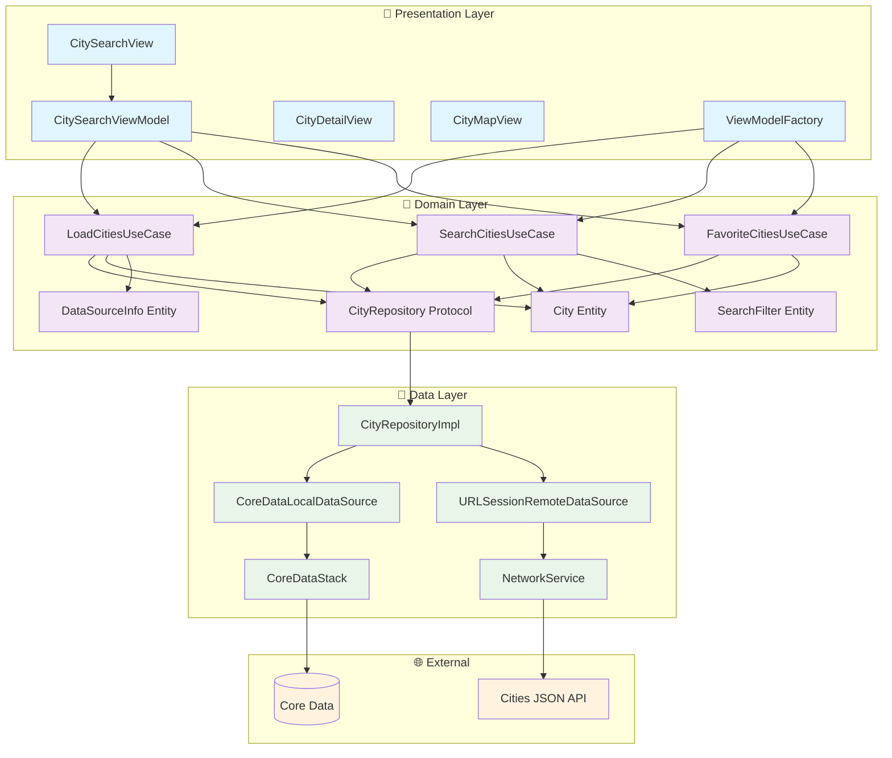
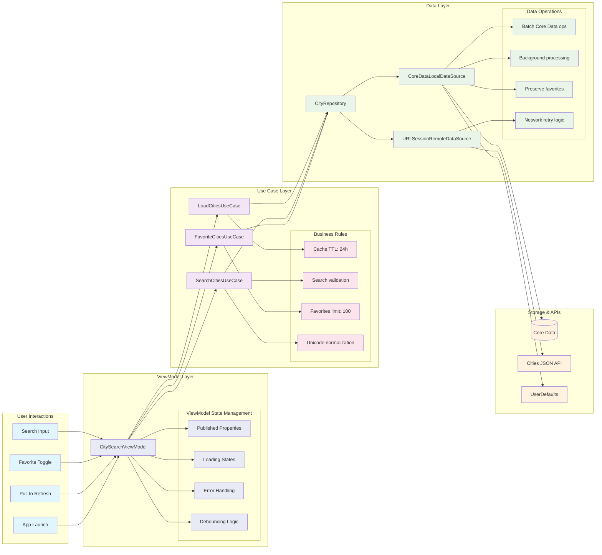

# ualaCities - Architecture Diagrams

Este documento contiene los diagramas de arquitectura del proyecto SmartCityExploration, implementando Clean Architecture con MVVM pattern.

## 🏗️ Clean Architecture Overview



## 📱 Presentation Layer Architecture

```mermaid
graph TB
    subgraph "Views (SwiftUI)"
        CSV[CitySearchView]
        CDV[CityDetailView]
        CMV[CityMapView]
        CMP[CityMapPin Component]
        IR[InfoRow Component]
    end
    
    subgraph "ViewModels (@MainActor)"
        CSVM[CitySearchViewModel]
        
        subgraph "ViewModel State"
            ST1[searchText: String]
            ST2[cities: [City]]
            ST3[favorites: [City]]
            ST4[isLoading: Bool]
            ST5[searchResults: [City]]
            ST6[dataSourceInfo: DataSourceInfo?]
        end
        
        subgraph "ViewModel Methods"
            M1[loadInitialData()]
            M2[performSearch()]
            M3[toggleFavorite()]
            M4[refreshData()]
            M5[clearSearch()]
        end
    end
    
    subgraph "Factory Pattern"
        VMF[CitySearchViewModelFactory]
        RF[CityRepositoryFactory]
    end
    
    CSV --> CSVM
    CDV --> CSVM
    CMV --> CSVM
    CMP --> CSVM
    
    CSVM --> ST1
    CSVM --> ST2
    CSVM --> ST3
    CSVM --> ST4
    CSVM --> ST5
    CSVM --> ST6
    
    CSVM --> M1
    CSVM --> M2
    CSVM --> M3
    CSVM --> M4
    CSVM --> M5
    
    VMF --> CSVM
    VMF --> RF
    
    classDef view fill:#e1f5fe
    classDef viewmodel fill:#e8eaf6
    classDef state fill:#f3e5f5
    classDef factory fill:#e0f2f1
    
    class CSV,CDV,CMV,CMP,IR view
    class CSVM viewmodel
    class ST1,ST2,ST3,ST4,ST5,ST6,M1,M2,M3,M4,M5 state
    class VMF,RF factory
```

## 🔧 Domain Layer Architecture

```mermaid
graph TB
    subgraph "Use Cases (Business Logic)"
        LUC[LoadCitiesUseCase]
        SUC[SearchCitiesUseCase]
        FUC[FavoriteCitiesUseCase]
        
        subgraph "LoadCitiesUseCase Logic"
            L1[execute: Check cache TTL]
            L2[forceRefresh: Download new data]
            L3[getDataInfo: Diagnostics]
            L4[Cache expires after 24h]
        end
        
        subgraph "SearchCitiesUseCase Logic"
            S1[execute: City → Country priority]
            S2[validateFilter: Min length, limits]
            S3[applyFilters: Favorites, query]
            S4[Unicode normalization]
        end
        
        subgraph "FavoriteCitiesUseCase Logic"
            F1[toggleFavorite: Max 100 limit]
            F2[getFavorites: All favorites]
            F3[addToFavorites: Validation]
            F4[removeFromFavorites: Safe removal]
        end
    end
    
    subgraph "Domain Entities"
        CE[City Entity]
        SF[SearchFilter Entity]
        DSI[DataSourceInfo Entity]
        CO[Coordinate Entity]
        
        subgraph "City Properties"
            CP1[id: Int]
            CP2[name: String]
            CP3[country: String]
            CP4[coord: Coordinate]
            CP5[isFavorite: Bool]
            CP6[displayName: computed]
            CP7[searchableText: computed]
        end
        
        subgraph "SearchFilter Properties"
            SP1[query: String]
            SP2[showOnlyFavorites: Bool]
            SP3[limit: Int?]
            SP4[searchInCountry: Bool]
        end
    end
    
    subgraph "Repository Protocol"
        RP[CityRepository Protocol]
        
        subgraph "Repository Methods"
            RM1[downloadAndSaveCities()]
            RM2[searchCities(filter)]
            RM3[toggleFavorite(city)]
            RM4[getAllCities()]
            RM5[getDataSourceInfo()]
        end
    end
    
    LUC --> L1
    LUC --> L2
    LUC --> L3
    LUC --> L4
    
    SUC --> S1
    SUC --> S2
    SUC --> S3
    SUC --> S4
    
    FUC --> F1
    FUC --> F2
    FUC --> F3
    FUC --> F4
    
    LUC --> RP
    SUC --> RP
    FUC --> RP
    
    LUC --> CE
    LUC --> DSI
    SUC --> CE
    SUC --> SF
    FUC --> CE
    
    CE --> CP1
    CE --> CP2
    CE --> CP3
    CE --> CP4
    CE --> CP5
    CE --> CP6
    CE --> CP7
    
    SF --> SP1
    SF --> SP2
    SF --> SP3
    SF --> SP4
    
    RP --> RM1
    RP --> RM2
    RP --> RM3
    RP --> RM4
    RP --> RM5
    
    classDef usecase fill:#f3e5f5
    classDef entity fill:#e8f5e8
    classDef protocol fill:#fff3e0
    classDef logic fill:#fce4ec
    
    class LUC,SUC,FUC usecase
    class CE,SF,DSI,CO entity
    class RP protocol
    class L1,L2,L3,L4,S1,S2,S3,S4,F1,F2,F3,F4,CP1,CP2,CP3,CP4,CP5,CP6,CP7,SP1,SP2,SP3,SP4,RM1,RM2,RM3,RM4,RM5 logic
```

## 💾 Data Layer Architecture

```mermaid
graph TB
    subgraph "Repository Implementation"
        CRI[CityRepositoryImpl]
        
        subgraph "Repository Methods"
            R1[downloadAndSaveCities: Orchestrates data flow]
            R2[searchCities: Delegates to local data source]
            R3[toggleFavorite: Updates persistence]
            R4[getDataSourceInfo: Aggregates metrics]
        end
    end
    
    subgraph "Data Sources"
        LDS[CoreDataLocalDataSource]
        RDS[URLSessionRemoteDataSource]
        
        subgraph "Local Data Source"
            L1[saveCities: Batch operations]
            L2[searchCities: Optimized queries]
            L3[getFavoriteCities: Filtered fetch]
            L4[toggleFavorite: Thread-safe updates]
            L5[Preserve favorites during refresh]
        end
        
        subgraph "Remote Data Source"
            R1[downloadCities: HTTP client]
            R2[Retry mechanism: 3 attempts]
            R3[Network error mapping]
            R4[JSON decoding with validation]
        end
    end
    
    subgraph "Core Data Stack"
        CDS[CoreDataStack]
        CE[CityEntity + Extensions]
        
        subgraph "Core Data Features"
            C1[Thread-safe operations]
            C2[Background context for data ops]
            C3[Main context for UI]
            C4[Batch insert/update/delete]
            C5[Optimized fetch requests]
        end
        
        subgraph "CityEntity Extensions"
            E1[fetchRequestById]
            E2[fetchRequestForFavorites]
            E3[fetchRequestForCityNamePrefix]
            E4[fetchRequestForCountryPrefix]
            E5[normalizeQuery helper]
        end
    end
    
    subgraph "Network Layer"
        NS[URLSessionNetworkService]
        NC[NetworkConfiguration]
        
        subgraph "Network Features"
            N1[URLSession with timeout]
            N2[Automatic retry logic]
            N3[Error mapping and handling]
            N4[Request/Response logging]
        end
    end
    
    subgraph "External Dependencies"
        API[Cities JSON API]
        CD[(Core Data SQLite)]
        UD[UserDefaults: Last update]
    end
    
    CRI --> R1
    CRI --> R2
    CRI --> R3
    CRI --> R4
    
    CRI --> LDS
    CRI --> RDS
    
    LDS --> L1
    LDS --> L2
    LDS --> L3
    LDS --> L4
    LDS --> L5
    
    RDS --> R1
    RDS --> R2
    RDS --> R3
    RDS --> R4
    
    LDS --> CDS
    RDS --> NS
    
    CDS --> C1
    CDS --> C2
    CDS --> C3
    CDS --> C4
    CDS --> C5
    
    CDS --> CE
    CE --> E1
    CE --> E2
    CE --> E3
    CE --> E4
    CE --> E5
    
    NS --> NC
    NS --> N1
    NS --> N2
    NS --> N3
    NS --> N4
    
    CDS --> CD
    NS --> API
    LDS --> UD
    
    classDef repository fill:#e8f5e8
    classDef datasource fill:#e1f5fe
    classDef coredata fill:#f3e5f5
    classDef network fill:#fff3e0
    classDef external fill:#ffebee
    classDef method fill:#fce4ec
    
    class CRI repository
    class LDS,RDS datasource
    class CDS,CE coredata
    class NS,NC network
    class API,CD,UD external
    class R1,R2,R3,R4,L1,L2,L3,L4,L5,R1,R2,R3,R4,C1,C2,C3,C4,C5,E1,E2,E3,E4,E5,N1,N2,N3,N4 method
```



## 🔄 Data Flow Architecture



## 🎯 Dependency Injection Architecture

```mermaid
graph TB
    subgraph "Factory Layer"
        VMF[CitySearchViewModelFactory]
        RF[CityRepositoryFactory]
        
        subgraph "Factory Methods"
            F1[create(): Production]
            F2[createMock(): Testing]
        end
    end
    
    subgraph "Dependency Graph"
        VM[CitySearchViewModel]
        
        subgraph "Use Cases"
            UC1[LoadCitiesUseCase]
            UC2[SearchCitiesUseCase]
            UC3[FavoriteCitiesUseCase]
        end
        
        subgraph "Repository"
            REPO[CityRepository]
        end
        
        subgraph "Data Sources"
            LOCAL[CoreDataLocalDataSource]
            REMOTE[URLSessionRemoteDataSource]
        end
        
        subgraph "Infrastructure"
            CDS[CoreDataStack]
            NS[NetworkService]
        end
    end
    
    subgraph "Testing Layer"
        TMF[TestMockFactory]
        
        subgraph "Mock Objects"
            MUC1[MockLoadCitiesUseCase]
            MUC2[MockSearchCitiesUseCase]
            MUC3[MockFavoriteCitiesUseCase]
            MREPO[MockCityRepository]
        end
    end
    
    %% Production Dependencies
    VMF --> F1
    VMF --> F2
    VMF --> RF
    
    F1 --> VM
    VM --> UC1
    VM --> UC2
    VM --> UC3
    
    UC1 --> REPO
    UC2 --> REPO
    UC3 --> REPO
    
    REPO --> LOCAL
    REPO --> REMOTE
    
    LOCAL --> CDS
    REMOTE --> NS
    
    %% Test Dependencies
    F2 --> TMF
    TMF --> MUC1
    TMF --> MUC2
    TMF --> MUC3
    TMF --> MREPO
    
    %% Alternative test injection
    VM -.-> MUC1
    VM -.-> MUC2
    VM -.-> MUC3
    
    classDef factory fill:#e1f5fe
    classDef production fill:#e8f5e8
    classDef testing fill:#fff3e0
    classDef mock fill:#ffebee
    
    class VMF,RF,F1,F2 factory
    class VM,UC1,UC2,UC3,REPO,LOCAL,REMOTE,CDS,NS production
    class TMF testing
    class MUC1,MUC2,MUC3,MREPO mock
```

## 📱 SwiftUI + MVVM Integration

```mermaid
graph TB
    subgraph "SwiftUI Views"
        CSV[CitySearchView]
        
        subgraph "View Hierarchy"
            VH1[NavigationStack]
            VH2[SearchBar]
            VH3[List/LazyVStack]
            VH4[CityRow Components]
            VH5[Loading/Error States]
        end
        
        subgraph "View Modifiers"
            MOD1[.searchable]
            MOD2[.refreshable]
            MOD3[.alert]
            MOD4[.navigationTitle]
        end
    end
    
    subgraph "ViewModel (@MainActor)"
        VM[CitySearchViewModel]
        
        subgraph "@Published Properties"
            P1[searchText: String]
            P2[cities: [City]]
            P3[favorites: [City]]
            P4[isLoading: Bool]
            P5[searchResults: [City]]
            P6[showError: Bool]
            P7[errorMessage: String?]
        end
        
        subgraph "Computed Properties"
            CP1[displayedCities: [City]]
            CP2[isSearching: Bool]
            CP3[hasSearchResults: Bool]
        end
        
        subgraph "Action Methods"
            A1[loadInitialData()]
            A2[performSearch()]
            A3[toggleFavorite()]
            A4[clearSearch()]
            A5[refreshData()]
        end
    end
    
    subgraph "Reactive Bindings"
        BIND1[$searchText binding]
        BIND2[State observations]
        BIND3[Combine publishers]
        BIND4[Debouncing logic]
    end
    
    subgraph "SwiftUI Lifecycle"
        LIFE1[.onAppear]
        LIFE2[.task]
        LIFE3[.onChange]
        LIFE4[.refreshable]
    end
    
    CSV --> VH1
    CSV --> VH2
    CSV --> VH3
    CSV --> VH4
    CSV --> VH5
    
    CSV --> MOD1
    CSV --> MOD2
    CSV --> MOD3
    CSV --> MOD4
    
    CSV --> VM
    
    VM --> P1
    VM --> P2
    VM --> P3
    VM --> P4
    VM --> P5
    VM --> P6
    VM --> P7
    
    VM --> CP1
    VM --> CP2
    VM --> CP3
    
    VM --> A1
    VM --> A2
    VM --> A3
    VM --> A4
    VM --> A5
    
    VH2 --> BIND1
    CSV --> BIND2
    VM --> BIND3
    BIND3 --> BIND4
    
    CSV --> LIFE1
    CSV --> LIFE2
    CSV --> LIFE3
    CSV --> LIFE4
    
    LIFE1 --> A1
    LIFE2 --> A1
    LIFE3 --> A2
    LIFE4 --> A5
    
    classDef view fill:#e1f5fe
    classDef viewmodel fill:#e8eaf6
    classDef binding fill:#f3e5f5
    classDef lifecycle fill:#e8f5e8
    classDef property fill:#fce4ec
    
    class CSV,VH1,VH2,VH3,VH4,VH5,MOD1,MOD2,MOD3,MOD4 view
    class VM viewmodel
    class BIND1,BIND2,BIND3,BIND4 binding
    class LIFE1,LIFE2,LIFE3,LIFE4 lifecycle
    class P1,P2,P3,P4,P5,P6,P7,CP1,CP2,CP3,A1,A2,A3,A4,A5 property
```

---

## 📋 Architecture Summary

### Key Architectural Decisions

1. **Clean Architecture**: Clear separation between Presentation, Domain, and Data layers
2. **MVVM Pattern**: ViewModels manage UI state and business logic coordination
3. **Dependency Injection**: Manual DI with Factory pattern for testability
4. **Swift 6 Concurrency**: @MainActor for UI, background tasks for data operations
5. **Repository Pattern**: Abstract data access with multiple data sources
6. **Use Case Pattern**: Encapsulate business rules and validation logic

### Performance Optimizations

1. **Batch Core Data Operations**: Efficient large dataset handling
2. **Debouncing**: Prevent excessive search operations
3. **Background Processing**: Keep UI responsive during data operations
4. **Smart Caching**: 24-hour TTL with fallback to local data
5. **Optimized Queries**: Prioritized search (city → country)

### Testing Strategy

1. **Unit Tests**: Isolated testing with mock dependencies
2. **Use Case Tests**: Business logic validation
3. **ViewModel Tests**: State management and UI interactions
4. **Integration Tests**: End-to-end data flow validation
