# ualaCities - Sequence Diagrams

Este documento contiene los diagramas de secuencia que muestran los flujos de interacción en el proyecto SmartCityExploration.

## 🚀 App Launch & Initial Data Load

## 🔍 Smart Search Flow

## ⭐ Favorite Toggle Flow

## 🔄 Pull to Refresh Flow

## 🏗️ Factory Pattern Initialization

## 🧪 Testing Flow with Mocks

## 🎯 Search Priority Algorithm Flow

```mermaid
sequenceDiagram
    participant U as User
    participant VM as CitySearchViewModel
    participant LDS as CoreDataLocalDataSource
    participant CD as Core Data

    Note over U: User types "A"
    U->>VM: searchText = "A"
    VM->>LDS: searchCities(filter: "A")
    
    Note over LDS: Step 1: Search by city name first
    LDS->>LDS: normalizeQuery("A") -> "a"
    LDS->>CD: fetchRequestForCityNamePrefixSearch("a", limit: 50)
    Note over CD: WHERE searchableText BEGINSWITH[c] "a"
    CD-->>LDS: [Alabama, Anchorage, Austin, ...] (30 cities)
    
    Note over LDS: Step 2: Calculate remaining limit
    LDS->>LDS: remainingLimit = 50 - 30 = 20
    
    Note over LDS: Step 3: Search by country (excluding found cities)
    LDS->>LDS: foundIds = [Alabama.id, Anchorage.id, ...]
    LDS->>CD: fetchRequestForCountryPrefixSearch("a", excludingIds: foundIds, limit: 20)
    Note over CD: WHERE country BEGINSWITH[c] "a" AND id NOT IN foundIds
    CD-->>LDS: [Sydney,AU], [Melbourne,AU], [ÁLAVA,ES] (20 cities)
    
    Note over LDS: Step 4: Combine results with priority
    LDS->>LDS: result = cityMatches + countryMatches
    LDS->>LDS: Convert [CityEntity] -> [City]
    LDS-->>VM: [Alabama, Anchorage, Austin, ..., Sydney,AU, Melbourne,AU, ÁLAVA,ES]
    
    Note over VM: City name matches appear first, then country matches
    VM->>U: Display prioritized results
```

## 🔗 Unicode Normalization Flow

```mermaid
sequenceDiagram
    participant U as User
    participant VM as CitySearchViewModel
    participant LDS as CoreDataLocalDataSource
    participant NORM as String.folding()

    Note over U: User types "Á" (with accent)
    U->>VM: searchText = "Á"
    VM->>LDS: searchCities(filter: "Á")
    
    Note over LDS: Normalize query for consistent search
    LDS->>NORM: normalizeQuery("Á")
    NORM->>NORM: precomposedStringWithCanonicalMapping
    NORM->>NORM: folding(diacriticInsensitive, caseInsensitive)
    NORM-->>LDS: "a" (normalized)
    
    Note over LDS: Search with normalized query
    LDS->>LDS: Search database with "a"
    Note over LDS: Database searchableText already normalized during insert
    
    Note over LDS: Results include both accented and non-accented matches
    LDS-->>VM: [Alabama, ÁLAVA, Anchorage, ...] (bidirectional match)
    
    Note over VM: Both "A" and "Á" find same results
    VM->>U: Display all matching cities regardless of accent input
```

## 🚨 Error Handling Flow

---

## 📋 Sequence Diagrams Summary

### Key Interaction Patterns

1. **Async/Await Flow**: All async operations use Swift concurrency patterns
2. **MainActor Isolation**: UI updates are guaranteed to be on main thread  
3. **Error Handling**: Graceful degradation with fallback to cached data
4. **Performance Optimization**: Debouncing, batch operations, background processing
5. **Data Consistency**: Favorite preservation during refresh operations

### Business Logic Flows

1. ** Search**: Priority-based search (city → country) with Unicode normalization
2. **Cache Strategy**: 24-hour TTL with intelligent refresh logic
3. **Favorite Management**: Limit enforcement and data consistency
4. **State Management**: Reactive UI updates with @Published properties

### Testing Strategy

1. **Mock Injection**: Isolated testing with controllable mock responses
2. **MainActor Testing**: Proper concurrency handling in test environment
3. **State Verification**: Assert on ViewModel published properties
4. **Async Testing**: Proper async/await testing patterns
